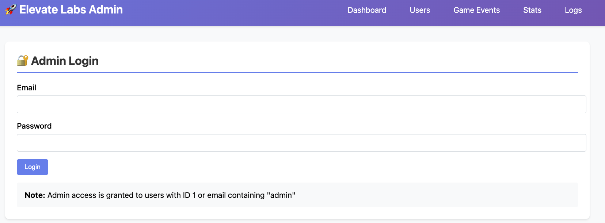
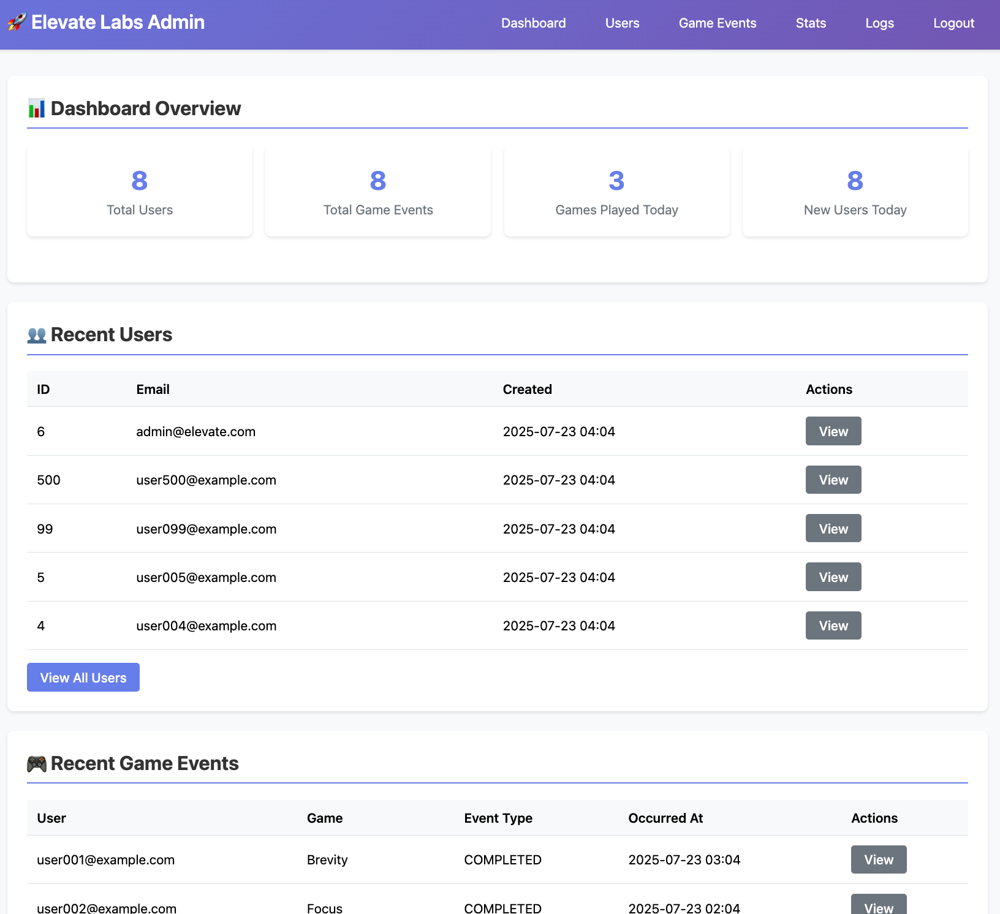
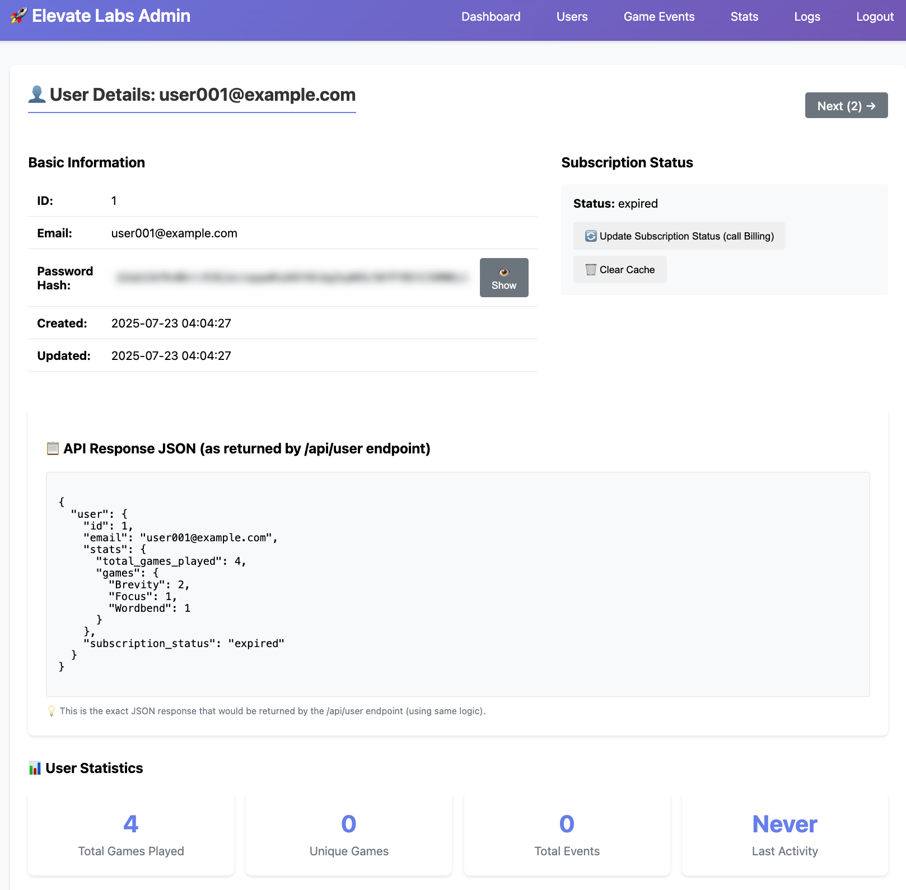
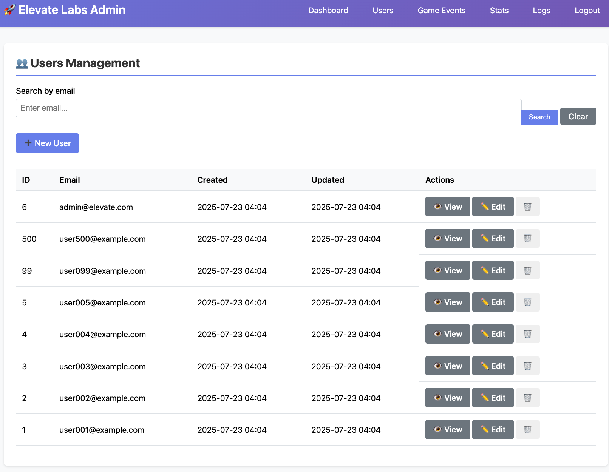
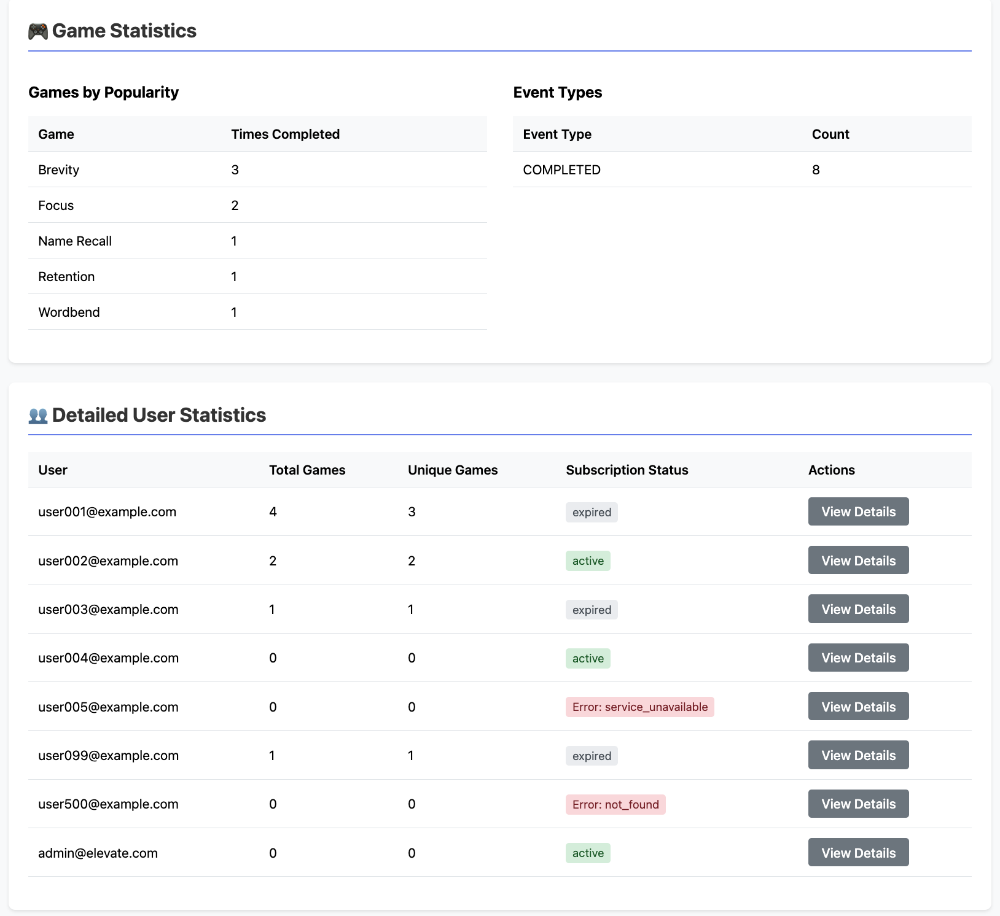
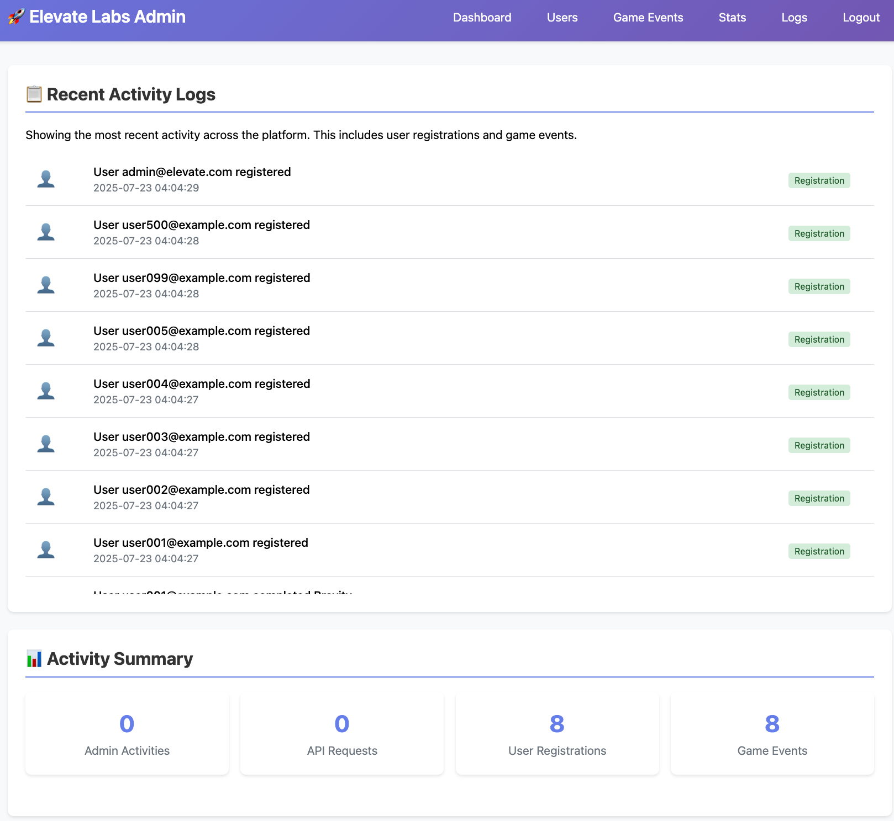

# Admin Interface Guide

Complete guide for using the Elevate Labs admin interface.

## Overview

The admin interface provides a web-based UI for managing users, game events, and viewing statistics. It's designed for internal team use and provides comprehensive data management capabilities.

### Visual Interface

The admin interface features a modern, responsive design with intuitive navigation and clear data presentation.

_Clean login interface with email and password fields_

## Access

- **URL**: http://localhost:3000/admin/login
- **Email**: admin@elevate.com
- **Password**: Admin123!

## Features

### Dashboard (`/admin`)

The main dashboard provides an overview of the system:

- **User Statistics**: Total users, active users, new registrations
- **Game Event Statistics**: Total events, events by game type
- **Recent Activity**: Latest user registrations and game events
- **Quick Navigation**: Links to all admin sections

_Dashboard showing system overview with statistics and recent activity_

### User Management (`/admin/users`)

Comprehensive user management interface:

#### User List

- **Pagination**: Browse through all users
- **Search**: Find users by email
- **User Details**: View user information and statistics
- **Actions**: Create, edit, and delete users

_Detailed user view with statistics and subscription status_

#### Create User

- **Form**: Email and password fields
- **Validation**: Real-time validation feedback
- **Success**: Automatic redirect to user list

#### Edit User

- **Form**: Pre-populated with current data
- **Update**: Modify email and password
- **Delete**: Remove user with confirmation

#### User Details

- **Profile**: Basic user information
- **Statistics**: Game play statistics
- **Subscription**: Current subscription status
- **Game Events**: List of user's game activities

_Detailed user view with statistics and subscription status_

### Game Events Management (`/admin/game_events`)

Manage all game events in the system:

#### Event List

- **Pagination**: Browse through all events
- **Filtering**: Filter by game name and user
- **Sorting**: Sort by date, user, or game
- **Actions**: Create, edit, and delete events

_Game events list with filtering and management options_

#### Create Game Event

- **Form**: Game name, event type, user, and date
- **Validation**: Ensure valid game names and users
- **Success**: Event added to user's statistics

#### Edit Game Event

- **Form**: Modify event details
- **Update**: Save changes to event
- **Delete**: Remove event with confirmation

### Statistics (`/admin/stats`)

Detailed statistics and analytics:

#### User Statistics

- **Total Users**: Count of all registered users
- **Active Users**: Users with recent activity
- **Subscription Status**: Active vs expired subscriptions
- **User Growth**: Registration trends

_Detailed user statistics with subscription status breakdown_

#### Game Statistics

- **Total Events**: Count of all game events
- **Events by Game**: Breakdown by game type
- **Popular Games**: Most played games
- **Event Trends**: Activity over time

#### Detailed User Stats

- **Individual Users**: Per-user statistics
- **Subscription Status**: Real-time billing data
- **Game History**: Complete game event history
- **Performance Metrics**: User engagement data

### Activity Logs (`/admin/logs`)

Monitor system activity:

#### Admin Activity Logs

- **User Management**: Create, update, delete actions
- **Game Event Management**: Event modifications
- **Admin Actions**: Who did what and when
- **Audit Trail**: Complete activity history

#### API Request Logs

- **API Calls**: All API endpoint requests
- **User Activity**: Which users are using the API
- **Error Tracking**: Failed requests and errors
- **Performance**: Response times and patterns

_Admin activity and API request logs with detailed timestamps and actions_

## Authentication

### Session-based Authentication

- **Login Required**: All admin routes require authentication
- **Session Management**: Secure session cookies
- **Logout**: Secure session destruction
- **Access Control**: Admin-only access

### Admin Access Rules

- **User ID 1**: Automatically has admin access
- **Email Pattern**: Users with "admin" in email
- **Security**: bcrypt password verification

## Navigation

### Main Navigation

- **Dashboard**: Overview and statistics
- **Users**: User management
- **Game Events**: Event management
- **Statistics**: Detailed analytics
- **Logs**: Activity monitoring
- **Logout**: Secure logout

### Breadcrumbs

- **Context**: Shows current location
- **Navigation**: Easy back navigation
- **Hierarchy**: Clear page relationships

## User Interface

### Design Principles

- **Clean Layout**: Modern, professional design
- **Responsive**: Works on desktop and mobile
- **Consistent**: Uniform styling throughout
- **Accessible**: Easy to use and navigate

### Color Scheme

- **Primary**: Blue for main actions
- **Success**: Green for positive actions
- **Warning**: Orange for caution
- **Danger**: Red for destructive actions
- **Info**: Gray for neutral information

### Interactive Elements

- **Buttons**: Clear action buttons
- **Forms**: Validated input forms
- **Tables**: Sortable data tables
- **Modals**: Confirmation dialogs
- **Alerts**: Success and error messages

## Data Management

### User Operations

- **Create**: Add new users to the system
- **Read**: View user details and statistics
- **Update**: Modify user information
- **Delete**: Remove users with confirmation

### Game Event Operations

- **Create**: Add new game events
- **Read**: View event details
- **Update**: Modify event information
- **Delete**: Remove events with confirmation

### Data Validation

- **Client-side**: Real-time form validation
- **Server-side**: Secure backend validation
- **Error Handling**: Clear error messages
- **Success Feedback**: Confirmation of actions

## Security Features

### Access Control

- **Authentication Required**: All admin routes protected
- **Session Security**: Secure session management
- **CSRF Protection**: Cross-site request forgery protection
- **Input Validation**: Secure input handling

### Data Protection

- **Password Hashing**: bcrypt password storage
- **SQL Injection Protection**: Parameterized queries
- **XSS Protection**: Cross-site scripting prevention
- **Error Handling**: Secure error messages

## Troubleshooting

### Common Issues

#### Login Problems

- **Check Credentials**: Verify email and password
- **Session Issues**: Clear browser cookies
- **Server Status**: Ensure Rails server is running

#### Data Display Issues

- **Refresh Page**: Reload to get latest data
- **Check Filters**: Verify filter settings
- **Database**: Ensure database is accessible

#### Performance Issues

- **Pagination**: Use pagination for large datasets
- **Caching**: Check Redis cache status
- **Server Resources**: Monitor server performance

### Support

- **Logs**: Check Rails logs for errors
- **Database**: Verify database connectivity
- **Cache**: Check Redis cache status
- **Network**: Ensure external service connectivity
